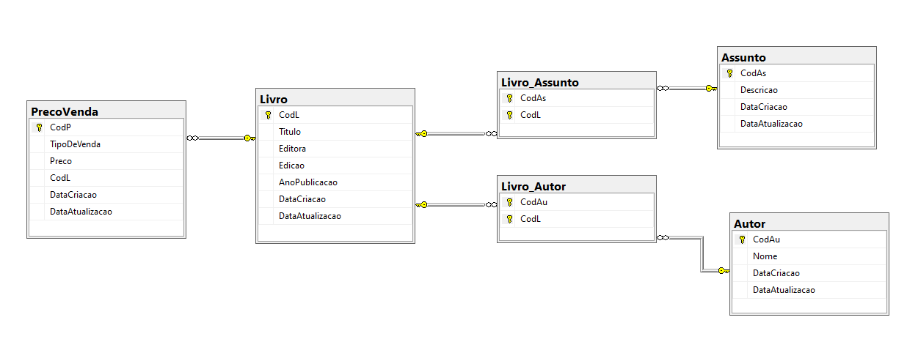

# Desafio Biblioteca

Instruções:
Deve ser feito CRUD para Livro, Autor e Assunto conforme o modelo de dados.

O modelo do banco deve ser seguido integralmente, salvo para ajustes de melhoria de performance.

O modelo inicial não prevê, mas é necessário incluir uma forma de informar o valor (em R$) do livro dependendo da forma de compra do mesmo (exemplos: balcão, self-service, internet, evento, etc). Deve ser feito tanto o modelo quanto a implementação necessária para que esteja disponível para o usuário final.

Modelo de dados proposto:

Modelo de dados:

